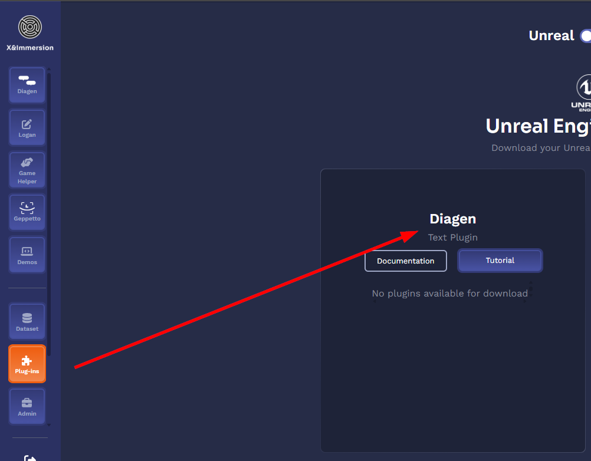

# DIAGEN for Unreal

A high-quality, local-first dialogue generation plugin for Unreal Engine (5.2+), powered by LLMs.

---

## Table of Contents

1. [Explication about LLM](#1-explication-about-llm)  
   - [1.1. Description (System Prompt)](#11-description-system-prompt)  
   - [1.2. Input (User Prompt)](#12-input-user-prompt)  
   - [1.3. History](#13-history)  
   - [1.4. Training Dataset](#14-training-dataset)  
   - [1.5. Parameters](#15-parameters)  
     - [1.5.1. Diagen LLM Parameters](#151-diagen-llm-parameters)  
     - [1.5.2. Diagen Prompt Parameters](#152-diagen-prompt-parameters)  
     - [1.5.3. Temperature](#153-temperature)  
     - [1.5.4. Context Size](#154-context-size)  
     - [1.5.5. Toxicity Filtering](#155-toxicity-filtering)  
2. [Diagen Files and Testing in the App (NO UNREAL)](#2-diagen-files-and-testing-in-the-app-no-unreal)  
   - [2.1. Explanation of State Tags](#21-explanation-of-state-tags)  
   - [2.2. Character Information (CI)](#22-character-information-ci)  
   - [2.3. Topic Detection](#23-topic-detection)  
   - [2.4. Diagen Event Files](#24-diagen-event-files)  
   - [2.5. State Tags Weight](#25-state-tags-weight)  
3. [Integration in Unreal](#3-integration-in-unreal)  
   - [3.1. How to Install the Diagen Plugin](#31-how-to-install-the-diagen-plugin)  
4. [Usage in Unreal](#4-usage-in-unreal)  
   - [4.1. Prompting the Model](#41-prompting-the-model)  
   - [4.2. Manage NPCs](#42-manage-npcs)  

---

## 1. Explication about LLM

Diagen uses a Large Language Model (LLM) trained on vast amounts of text to generate contextually relevant dialogue based on four main components:

- **System Prompt**  
- **User Prompt**  
- **History**  
- **LLM Parameters**

This enables dynamic interactions between players, NPCs, and the environment.

### 1.1. Description (System Prompt)

The system prompt provides context and defines the “role” or style of the LLM.  
You can generate it dynamically from the Character Information Table.

> _Example:_  
> `You are Abrogail, the ruthless and cunning Empress of Cheliax, feared across the realms. You speak with sharp, biting cynicism.`

[Back to Table of Contents](#table-of-contents)

### 1.2. Input (User Prompt)

Two types:

- **Questions**: directed at NPCs  
  _Example:_ `Hi! I'm Tom. How long have you been Queen?`
- **Instructions**: commands for in-world reactions  
  _Example:_ `You say that you demand this person to identify herself.`

> ⚠️ Unprompted LLMs may answer unpredictably without initial context.

[Back to Table of Contents](#table-of-contents)

### 1.3. History

For multi-turn conversations, include prior exchanges:
System Prompt
User #0
Assistant #0
User #1
Assistant #1
...
User Current
Assistant:

Trim old history to preserve tokens.

[Back to Table of Contents](#table-of-contents)

### 1.4. Training Dataset

Fine-tuning is currently unavailable in-app but can be arranged via [contact@xandimmersion.com](mailto:contact@xandimmersion.com).

Use custom lore, character backstories, and dialogue logs for more authentic responses.

[Back to Table of Contents](#table-of-contents)

### 1.5. Parameters

#### 1.5.1. Diagen LLM Parameters

Configure global LLM settings with `START DIAGEN LOCAL`:

| Parameter            | Default        | Description                                                      |
|----------------------|----------------|------------------------------------------------------------------|
| **Model Name**       | `baseXI7.gguf` | GGUF model file in `Plugins/Diagen/Local/models/`                |
| **Context Max Size** | `2048`         | Power of 2; max 8196                                             |
| **GPU Layers**       | `-1`           | Automatic selection                                              |
| **Flash Attention**  | `true`         | Speed optimization                                               |
| **GPU Select**       | `-1`           | For multi-GPU setups                                             |
| **Utilization**      | `1.0`          | GPU usage ratio (100%)                                           |
| **Max GPU Size GB**  | `1.0`          | For internal resource calculation                                |
| **Port**             | `8002`         | HTTP port for engine ↔ LLM communication                         |

[Back to Parameters](#15-parameters)

#### 1.5.2. Diagen Prompt Parameters

Per-prompt overrides in all `Diagen Prompt AI Model` nodes:

| Parameter               | Default | Description                          |
|-------------------------|---------|--------------------------------------|
| **N Predict**           | `80`    | Max tokens to generate; `-1` = none  |
| **Temperature**         | `2.0`   | Controls randomness/creativity       |
| **Dynamic Temp Range**  | `0.0`   | ± variation around temperature       |
| **Top-K**               | `40`    | Limit token selection to top K       |
| **Top-P**               | `0.95`  | Cumulative probability threshold     |
| **Cache Prompt**        | `true`  | Reuses common prefix for speed       |
| **Repeat Penalty**      | `1.0`   | Penalizes repeated tokens            |
| **Frequency Penalty**   | `0.8`   | Reduces frequent term repetition     |
| **Presence Penalty**    | `0.3`   | Reduces reuse of prior tokens        |
| **Stop Tokens**         | `[]`    | List of strings to halt generation   |

[Back to Parameters](#15-parameters)

#### 1.5.3. Temperature

| Value | Behavior                          |
|-------|-----------------------------------|
| `0.2` | Deterministic, focused            |
| `0.8` | Creative, varied                  |
| `2.0` | Novel, higher risk of incoherence |

[Back to Parameters](#15-parameters)

#### 1.5.4. Context Size

- **Short** (512): fast, concise  
- **Long** (2048+): detailed narratives  

Beware of token window limits.

[Back to Parameters](#15-parameters)

#### 1.5.5. Toxicity Filtering

| Level | Effect                         |
|-------|--------------------------------|
| `0.0` | No filtering                   |
| `1.0` | Strict safe content            |

Consider external moderation layers if needed.

[Back to Table of Contents](#table-of-contents)

---

## 2. Diagen Files and Testing in the App (NO UNREAL)

Use these CSV files to prototype NPC behavior before Unreal integration.

### 2.1. Explanation of State Tags

State tags enable/disable context for NPCs.

> Example: `angry`, `in_Brevoy`, `quest_of_the_frozen_flame`

[Back to Table of Contents](#table-of-contents)

### 2.2. Character Information (CI)

CSV fields:

- `name`: Identifier for description  
- `stateTags`: Comma-separated tags required  
- `description`: Text to include in system prompt  

Descriptions merge at runtime based on active tags.

[Back to Table of Contents](#table-of-contents)

### 2.3. Topic Detection

Defines dialogue triggers based on user input and tags.

| Field        | Description                            |
|--------------|----------------------------------------|
| `name`       | Topic ID                               |
| `stateTags`  | Active tags needed to detect topic     |
| `description`| Text prompt used for detection         |

[Back to Table of Contents](#table-of-contents)

### 2.4. Diagen Event Files

Configure in-game events and their effects:

| Field             | Description                                                  |
|-------------------|--------------------------------------------------------------|
| `name`            | Unique event key                                            |
| `stateTags`       | Tags required for event availability                         |
| `sayVerbatim`     | Exact NPC phrase                                            |
| `instruction`     | LLM-generated variation                                     |
| `returnTrigger`   | Value returned to game logic                                |
| `repeatable`      | Boolean: can re-trigger?                                     |
| `globalStateTags` | Boolean: apply tag changes to all NPCs                      |
| `enable/disable`  | Tags to add/remove upon trigger                             |
| `actionEvents`    | Blueprint functions to call                                 |

[Back to Table of Contents](#table-of-contents)

### 2.5. State Tags Weight

Prioritize which CI descriptions take precedence.

| Field    | Description                    |
|----------|--------------------------------|
| `name`   | Tag name                       |
| `weight` | Priority (higher = more urgent)|

[Back to Table of Contents](#table-of-contents)

---

## 3. Integration in Unreal

Diagen runs **locally** or **remotely** in UE5.2+.

> **Minimum**: NVIDIA GPU with ≥ 4 GB VRAM

### 3.1. How to Install the Diagen Plugin

1. Download from [create.xandimmersion.com](https://create.xandimmersion.com/)  
2. Place under `YourProject/Plugins/Diagen/`  
3. Launch Unreal Editor  
4. In `Edit > Project Settings > Plugins > Diagen`, paste your API Key  
5. Confirm download of local model

[Back to Table of Contents](#table-of-contents)

---

## 4. Usage in Unreal

> **Diagen requires** the local executable.

### 4.1. Prompting the Model

Use `BeginPlay` / `EndPlay` to manage the local process:

- `START DIAGEN LOCAL`  
- `STOP DIAGEN LOCAL`  
- `Get Diagen Local Executable Status` (pure)

Prompt with:

- **Raw**: `Diagen Prompt AI Model (Raw)`  
  

- **Structured**: use `Create Prompt` beforehand  
  

Streamed response:

[Back to Table of Contents](#table-of-contents)

### 4.2. Manage NPCs

Use a shared **SessionStates** array:

#### NPC Lifecycle

| Action    | Blueprint Node          |
|-----------|-------------------------|
| Add NPC   | `Add NPC`               |
| Remove NPC| `Remove NPC`            |
| Reset NPC | `Reset NPC`             |
| List NPCs | `Get Session NPC Names` |

#### State Tag Management

| Action          | Blueprint Node                    |
|-----------------|-----------------------------------|
| Append tags     | `Append NPC State Tags`           |
| Remove tags     | `Remove NPC State Tags`           |
| Clear all tags  | `Clear NPC State Tags`            |
| Set new tags    | `Set NPC State Tags`              |
| Query tags      | `Get NPC Enabled State Tags` / `Contains NPC State Tags` |

  
  
> ⚠️ `Bind All State Tags to NPC` is deprecated.  

[Back to Table of Contents](#table-of-contents)
